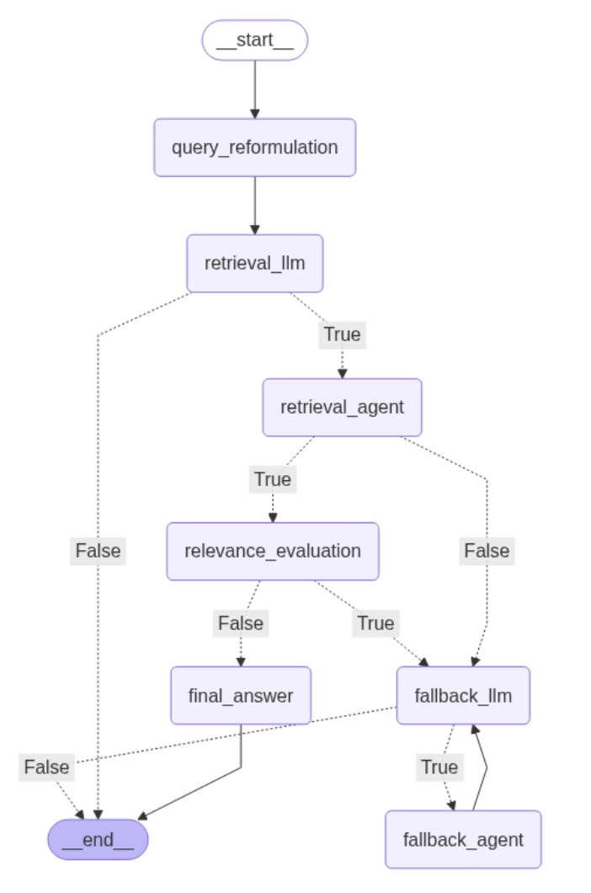

# Enhanced RAG Agent with Query Reformulation and Relevance Evaluation

An intelligent document retrieval system that combines local PDF document search with web search capabilities, featuring advanced query reformulation and relevance evaluation.

## Overview

This project implements a sophisticated Retrieval-Augmented Generation (RAG) agent using LangGraph that:

1. **Reformulates queries** for better retrieval effectiveness
2. **Searches local PDF documents** using vector embeddings
3. **Evaluates content relevance** to determine answer quality
4. **Falls back to web search** when local content is insufficient
5. **Provides comprehensive answers** from the most relevant sources

## Features

### 🔍 Intelligent Query Processing
- **Query Reformulation**: Expands user queries with synonyms, financial terminology, and context
- **Multi-perspective Analysis**: Considers different aspects of financial queries
- **Context Enhancement**: Adds relevant background for better retrieval

### 📚 Document Processing
- **PDF Loading**: Processes Stock Market Performance 2024 document
- **Intelligent Chunking**: Splits documents for optimal retrieval
- **Vector Embeddings**: Uses OpenAI embeddings for semantic search
- **ChromaDB Storage**: Persistent vector storage for efficient querying

### 🎯 Relevance Evaluation
- **Automated Assessment**: Evaluates if retrieved content answers the query
- **Four-tier Scoring**: DIRECT_ANSWER, PARTIAL_ANSWER, TANGENTIALLY_RELATED, NOT_RELEVANT
- **Smart Fallback**: Triggers web search only when needed

### 🌐 Web Search Integration
- **Tavily Search**: High-quality web search optimized for AI applications
- **Structured Results**: Formatted search results with titles, content, and sources
- **Fallback Strategy**: Seamless transition when document search is insufficient

## Architecture & Workflow

The system uses a **LangGraph state machine** with intelligent conditional routing:



*The diagram above shows the complete workflow with conditional branching and decision points.*

### System Approach

The agent follows a **multi-stage intelligent routing approach**:

1. **Query Enhancement**: Reformulates user queries with financial terminology and context for better retrieval
2. **Local-First Strategy**: Always searches the PDF document first using vector similarity
3. **Quality Assessment**: Evaluates if retrieved content actually answers the user's question
4. **Smart Fallback**: Only triggers web search when local content is insufficient or irrelevant
5. **Conditional Execution**: Each stage has conditional logic to prevent unnecessary processing

**Key Design Principles:**
- **Efficiency**: Minimize expensive operations (web search) by using local content when possible
- **Relevance**: Don't just retrieve content - ensure it actually answers the query
- **Transparency**: Clear routing decisions with explanations for each path taken
- **Fallback Safety**: Guarantee an answer even when local documents lack information

## Installation

### Prerequisites
- Python 3.8+
- OpenAI API key
- Tavily API key

### Setup

1. **Clone the repository**
   ```bash
   git clone https://github.com/jaindeepali010/financial_analyst_repo.git
   cd financial_analyst_repo
   ```

2. **Create virtual environment**
   ```bash
   python -m venv langgraph_env
   source langgraph_env/bin/activate  # On Windows: langgraph_env\Scripts\activate
   ```

3. **Install dependencies**
   ```bash
   pip install -r requirements.txt
   ```

4. **Set up environment variables**
   Create a `.env` file in the project root:
   ```env
   OPENAI_API_KEY=your_openai_api_key_here
   TAVILY_API_KEY=your_tavily_api_key_here
   ```

5. **Add your PDF document**
   Place your `Stock_Market_Performance_2024.pdf` file in the project root directory.

## Usage

### Running the Agent

```bash
python main.py
```

The agent will start an interactive session where you can ask questions about stock market performance.

### Visualizing the Graph

To visualize the agent's workflow graph, add this code to your script or run it in a Jupyter notebook:

```python
# Add these imports at the top of your file
from IPython.display import Image, display

# Add this after compiling the graph (after: rag_agent = graph.compile())
try:
    display(Image(rag_agent.get_graph().draw_mermaid_png()))
    print("Graph visualization displayed above")
except Exception as e:
    print(f"Could not display graph: {e}")
    print("Note: Graph visualization requires Jupyter notebook environment")
```

**For Jupyter Notebook users**: The graph will display directly in the notebook cell.
**For Python script users**: The graph won't display in terminal, but you can save it to a file instead (see Alternative Method below).

The generated diagram will match the workflow shown in the Architecture section above.

### Example Queries

```
What is your question: How did tech stocks perform in 2024?
What is your question: What was the impact of inflation on the market?
What is your question: Which sectors showed the best growth?
What is your question: exit
```

### Sample Interaction

```
=== ENHANCED RAG AGENT WITH QUERY REFORMULATION, RELEVANCE EVALUATION, AND TAVILY SEARCH ===

What is your question: What were the best performing stocks in 2024?

Original Query: What were the best performing stocks in 2024?
Reformulated Query: best performing stocks 2024 top gainers equity performance stock returns market leaders highest returns trading volume price appreciation growth stocks

Calling Retrieval Tool: retriever_tool with enhanced query: ...
Evaluating relevance for query: What were the best performing stocks in 2024?
Relevance Assessment: RELEVANT

=== ANSWER ===
Based on the Stock Market Performance 2024 document, the best performing stocks...
```

## Project Structure

```
financial_analyst_repo/
│
├── RAGAgent_with_query_reformulation_fallback.py                 # Main application file
├── Stock_Market_Performance_2024.pdf  # Source document
├── requirements.txt        # Python dependencies
├── .env                   # Environment variables (create this)
├── .gitignore            # Git ignore rules
├── chroma_db/            # Vector database storage (auto-created)
└── README.md             # This file
```

## Dependencies

### Core Libraries
- **LangGraph**: State machine orchestration
- **LangChain**: LLM framework and document processing
- **OpenAI**: GPT-4 and embedding models
- **ChromaDB**: Vector database for document storage
- **Tavily**: Web search API
- **IPython**: For graph visualization (optional)

### Document Processing
- **PyPDFLoader**: PDF document loading
- **RecursiveCharacterTextSplitter**: Intelligent text chunking

### Utilities
- **python-dotenv**: Environment variable management
- **typing**: Type annotations

## Configuration

### Model Settings
- **Primary LLM**: GPT-4o (temperature=0 for consistent responses)
- **Embeddings**: text-embedding-3-small
- **Chunk Size**: 1000 characters with 200 character overlap
- **Retrieval**: Top 5 similar documents
- **Web Search**: Up to 5 results with advanced search depth

### Customization Options

You can modify the following parameters in `RAGAgent_with_query_reformulation_fallback.py`:

```python
# Chunk size for document splitting
chunk_size = 1000
chunk_overlap = 200

# Number of documents to retrieve
search_kwargs = {"k": 5}

# Web search results
max_results = 5
```

## How It Works

### 1. Query Reformulation
The system enhances user queries by:
- Adding financial terminology and synonyms
- Expanding context with related concepts
- Including multiple search perspectives

### 2. Document Retrieval
- Searches the vector database using reformulated queries
- Retrieves top-k most similar document chunks
- Filters out documents with insufficient content

### 3. Relevance Evaluation
- Analyzes if retrieved content directly answers the query
- Uses a four-tier relevance scoring system
- Makes intelligent decisions about content sufficiency

### 4. Intelligent Fallback
- Activates web search only when document content is insufficient
- Uses original query for natural web search
- Provides comprehensive answers with proper source attribution

## Advanced Features

### State Management
The system maintains conversation state including:
- Original and reformulated queries
- Retrieved content and relevance scores
- Fallback activation status
- Tool execution tracking

### Error Handling
- Graceful handling of missing PDF files
- Robust vector database initialization
- Web search error recovery
- Tool execution validation

### Performance Optimization
- Persistent vector storage for fast subsequent queries
- Efficient document chunking strategies
- Optimized embedding and retrieval operations

## Troubleshooting

### Common Issues

1. **PDF Not Found**
   ```
   FileNotFoundError: PDF file not found: Stock_Market_Performance_2024.pdf
   ```
   **Solution**: Ensure the PDF file is in the project root directory.

2. **API Key Errors**
   ```
   openai.AuthenticationError: Incorrect API key
   ```
   **Solution**: Check your `.env` file and verify API keys are correct.

3. **ChromaDB Issues**
   ```
   Error setting up ChromaDB
   ```
   **Solution**: Delete the `chroma_db` folder and restart the application.

### Performance Tips

- **First Run**: Initial setup may take longer due to document processing and vector storage creation
- **Subsequent Runs**: Faster performance as vectors are loaded from persistent storage
- **Large Documents**: Consider adjusting chunk size for better performance with very large PDFs
